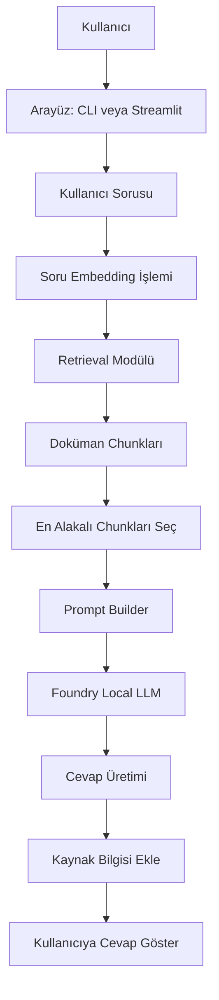
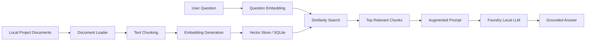
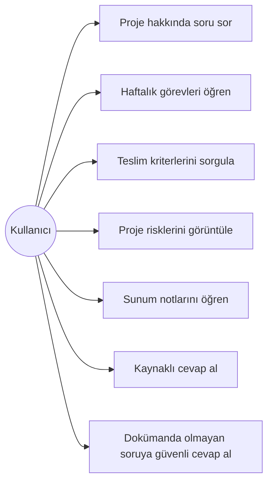
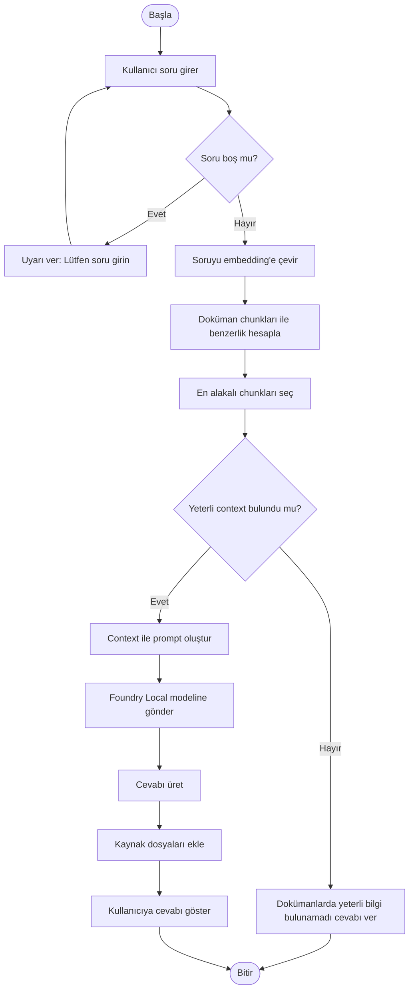
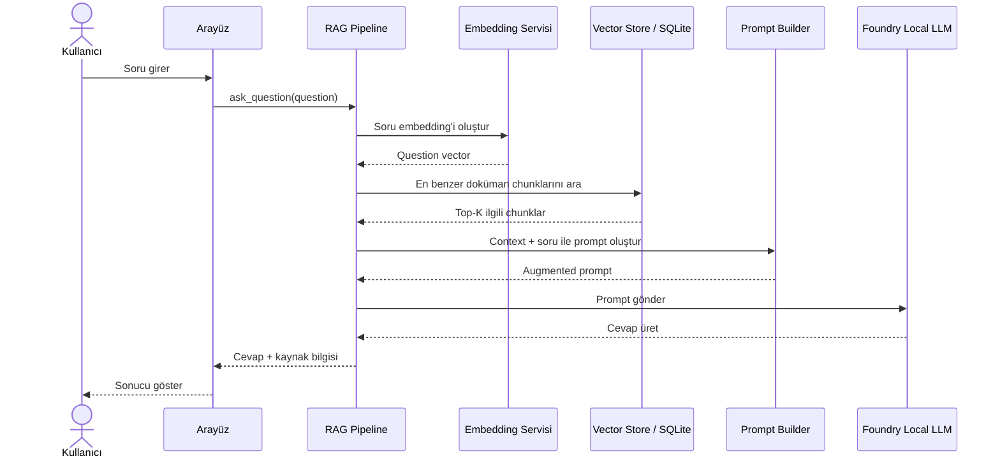
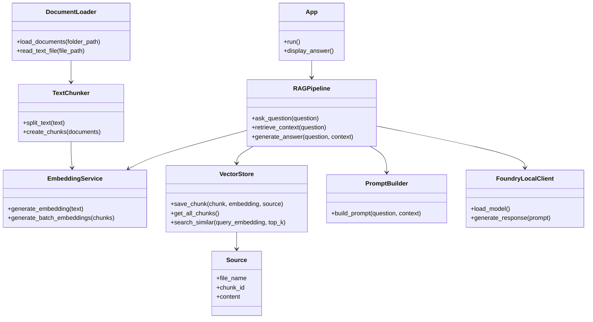
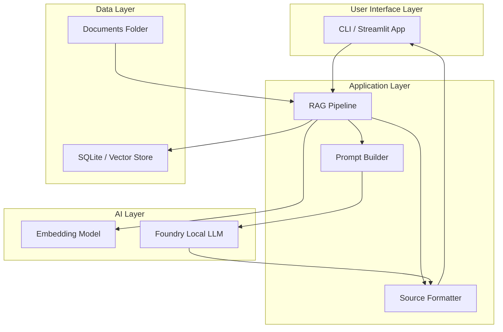
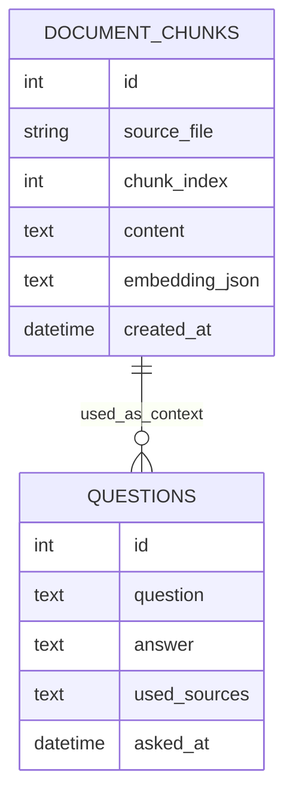

# YBS Proje Takip Asistanı — Proje Haritası ve UML Diagramları

## 1. Proje Haritası

**Proje Adı:** YBS Proje Takip Asistanı
**İngilizce Adı:** Local RAG Project Management Assistant
**Ana Teknoloji:** Microsoft Foundry Local + RAG
**Amaç:** YBS proje dokümanlarından bilgi çekerek proje süreciyle ilgili sorulara cevap veren yerel bir yapay zekâ asistanı geliştirmek.

---

## 2. Projenin Temel Amacı

Bu proje, proje yönetimi sürecinde kullanılan dokümanları daha erişilebilir hale getirmeyi amaçlar.

Kullanıcı; proje amacı, haftalık plan, görev listesi, teslim kriterleri, riskler ve sunum notları gibi dokümanlar hakkında doğal dilde soru sorabilir. Sistem, önce ilgili doküman parçalarını bulur, ardından bu bilgileri kullanarak cevap üretir.

Örnek sorular:

```text
Bu projenin amacı nedir?
Bu hafta hangi görevleri yapmalıyım?
Teslim kriterleri nelerdir?
Projedeki riskler nelerdir?
Sunumda projeyi nasıl anlatmalıyım?
RAG bu projede nasıl kullanılıyor?
```

---

## 3. Proje Bileşenleri

| Bileşen           | Açıklama                                                   |
| ----------------- | ---------------------------------------------------------- |
| Kullanıcı Arayüzü | Kullanıcının soru sorduğu CLI veya Streamlit ekranı        |
| Doküman Yükleyici | `documents/` klasöründeki proje dokümanlarını okur         |
| Chunking Modülü   | Uzun metinleri küçük parçalara böler                       |
| Embedding Modülü  | Metin parçalarını sayısal vektörlere dönüştürür            |
| Retrieval Modülü  | Kullanıcı sorusuna en yakın doküman parçalarını bulur      |
| Prompt Builder    | Bulunan bilgileri modele verilecek context haline getirir  |
| Foundry Local LLM | Yerel çalışan model ile cevap üretir                       |
| Kaynak Gösterme   | Cevabın hangi dokümandan üretildiğini gösterir             |
| Test Modülü       | Cevaplanabilir ve cevaplanamaz sorularla sistemi test eder |

---

## 4. Genel Sistem Haritası



---

## 5. RAG Akış Haritası



---

## 6. UML Use Case Diagram



---

## 7. UML Activity Diagram



---

## 8. UML Sequence Diagram



---

## 9. UML Class Diagram



---

## 10. UML Component Diagram



---

## 11. Veri Modeli

İlk MVP sürümünde veriler RAM üzerinde tutulabilir. Daha gelişmiş sürümde SQLite kullanılabilir.

### Önerilen SQLite Tablosu



---

## 12. Modül Sorumlulukları

| Modül           | Dosya                     | Görev                                        |
| --------------- | ------------------------- | -------------------------------------------- |
| App             | `app.py`                  | Uygulamayı başlatır, kullanıcıdan soru alır  |
| Document Loader | `document_loader.py`      | Dokümanları okur                             |
| Chunker         | `text_chunker.py`         | Metinleri parçalara böler                    |
| Embedding       | `embedding_service.py`    | Metinleri embedding'e dönüştürür             |
| Vector Store    | `vector_store.py`         | Chunk ve embedding verilerini saklar         |
| RAG Pipeline    | `rag_pipeline.py`         | Retrieval ve generation sürecini yönetir     |
| Prompt Builder  | `prompt_builder.py`       | Model için context destekli prompt üretir    |
| Test            | `tests/test_questions.md` | Test sorularını ve beklenen cevapları içerir |

---

## 13. Proje Akışının Basit Özeti

```text
1. Proje dokümanları documents klasörüne eklenir.
2. Sistem dokümanları okur.
3. Dokümanları küçük parçalara böler.
4. Her parçanın embedding vektörü oluşturulur.
5. Kullanıcı soru sorar.
6. Soru embedding'e çevrilir.
7. En alakalı doküman parçaları bulunur.
8. Bulunan parçalar prompt içine eklenir.
9. Foundry Local modeli cevap üretir.
10. Cevap, kaynak doküman bilgisiyle kullanıcıya gösterilir.
```

---

## 14. Current Implemented Architecture

```text
Documents → Loader → Chunker → TF-IDF Embeddings → SQLite rag.db → Semantic Retriever → Prompt Builder → Local Extractive/Fallback Answer → Sources
```

Şu anda YBS Proje Takip Asistanı'nda tam olarak çalışan RAG mimarisi şu şekildedir:
- **Doküman Yükleme:** `documents/` altındaki `.txt`, `.docx`, ve metin tabanlı `.pdf` dosyalarını temiz bir şekilde yükler.
- **Parçalama (Chunking):** Paragraf sınırlarını koruyarak maksimum 800 karakter boyutunda parçalar oluşturur.
- **Embedding:** Yerel TF-IDF vektörleştirici (fallback) kullanarak metin parçalarını ve sorguları sayısal vektörlere çevirir (Microsoft Foundry Local entegrasyonu için yapı hazırlanmıştır).
- **Vektör Deposu (SQLite):** `rag.db` adında yerel bir veritabanı kurarak chunk metinlerini, kaynak yollarını ve embedding JSON dizelerini saklar.
- **Semantik Arama:** Cosine Similarity hesaplayarak en benzer 3 chunk'ı çeker. Arama hatasında anahtar kelime tabanlı fall-back mekanizmasını çalıştırır.
- **Prompt Builder:** İlgili context parçalarını ve kuralları birleştirerek Türkçe prompt hazırlar.
- **Cevap Üretimi:** Microsoft Foundry Local LLM API'sine bağlanmayı dener; bulunamazsa, yerel context içinden en alakalı cümleleri seçen akıllı fallback modunu çalıştırır.

---

## 15. Target Foundry Local Architecture

```text
Documents → Loader → Chunker → Foundry Local Embeddings → SQLite/Vector Store → Semantic Retriever → Prompt Builder → Foundry Local Chat Model → Grounded Answer with Sources
```

Gelecek aşamalarda hedeflenen tam Microsoft Foundry Local entegrasyonu:
- **Embedding:** Microsoft Foundry Local SDK üzerinden yerel çalışan yüksek başarımlı bir dense embedding modeli (örneğin BERT veya MiniLM tabanlı) ile metinleri vektörleştirme.
- **Vektör Deposu:** SQLite üzerinde JSON aramak yerine, pgvector benzeri bir yerel vektör eklentisi veya doğrudan SQLite-vss entegrasyonu ile hızlı ANN aramaları yapma.
- **Local LLM:** Yerel donanım üzerinde (CPU/GPU) barındırılan Llama-3 veya Mistral benzeri 7B parametreli bir Foundry Local LLM modeli (Chat Model) ile prompt'ları işleyip yüksek kaliteli, özetlenmiş, doğal dilde cevaplar üretme.
